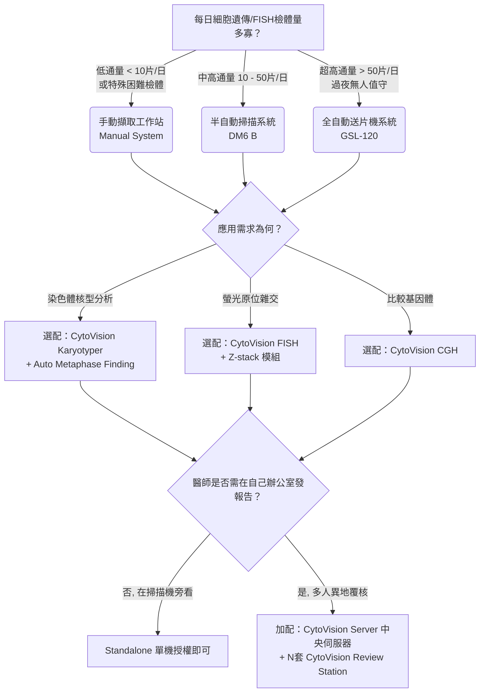

# CytoVision® 系統選型與訂貨規格指南

> ⚠️ **注意**：CytoVision 是高度客製化的系統建置，牽涉硬體相容性與 IT 網域設定。本文件提供業務**「選型決策樹」**、**「版本相容性規則」**與**「硬體組合」**，以幫助您引導客戶選擇正確架構。最終料號請務必以 **Leica Biosystems 官方最新 Pricing Tool** 為準。

---

## 🌳 業務銷售決策樹 (CytoVision Configuration Decision Tree)

為協助客戶挑選最適合的系統組合，請依循以下決策樹進行探詢：

---

## 📦 CytoVision 硬體架構與相容性 (Hardware & Optics)

CytoVision 依據自動化程度分為不同等級，且軟體能相容市面上兩大類核心硬體（顯微鏡與相機）：

### 1. 系統自動化層級
*   **Manual System (手動擷取)**：不含電動載物台，倚靠人工手動尋找細胞並軟體拍照分析。
*   **Automated System (自動掃描)**：搭配電動顯微鏡與電動載物台 (例如 8 片裝)，支援小批次無人值守掃描 (Walk-away)。
*   **GSL-120 (超高通量)**：配備 120 片大容量送片機與內建條碼機，並具備自動滴油功能，專為代檢中心與國家級實驗室設計。

### 2. 支援的顯微鏡主機 (Supported Microscopes)
許多醫院希望「沿用」既有顯微鏡以節省預算。CytoVision 的開放性支援多款主流廠牌，但如果要做到**全自動掃描 (尋找分裂相、Z-Stack)**，必須配備**全電動型號 (Fully Motorized)**：
*   **Leica (首選推薦)**：**DM6 B** (現行旗艦首選)、DM4 B、DM6000 B、DM4000 B、DM2500/3000 (手動或局動電動)。
*   **Olympus**：**BX63**、**BX61** (全電動首選)、BX53、BX51、BX43。
*   **Zeiss**：AxioImager Z2、AxioImager M2。
> 💡 **業務話術**：「我們能將您現有的 Olympus BX61 升級為 CytoVision 自動工作站，只要加裝電動載物台與相機即可，大幅保護您的硬體投資！」

### 3. 支援的照相機 (Supported Cameras)
核型分析與 FISH 需要極高感光度與解析度的相機：
*   **新世代主力配備**：**Leica 12 MP (百萬畫素) CMOS 高感度相機** (CytoVision DX 標配) 或是 Leica K3M / K3C 系列。具備極低的雜訊與超快幀率。
*   **傳統與第三方相容**：支援 JAI、IDS、Point Grey (FLIR Blackfly) 等工業級 CCD/CMOS 相機。

## 🧩 核心軟體分析模組 (Application Modules)

硬體平台選定後，需依照客戶的臨床檢驗項目選購軟體授權 (License)：

1.  **CytoVision Karyotyper (染色體核型分析)**
    *   *訂貨備註*：必選模組之一。包含 G-banding、R-banding 的影像擷取、強化、自動分類切割與排盤產生。
2.  **CytoVision FISH (螢光原位雜交分析)**
    *   *訂貨備註*：必選模組之一。包含多色螢光自動合成、背景雜訊抑制、Z-stack (多焦面融合) 與互動式訊號計數量測。支援組織與細胞 FISH。
3.  **CytoVision CGH (比較基因體雜交分析)**
    *   *訂貨備註*：選購模組，用於螢光強度差異分析。
4.  **CytoVision Automated Metaphase Finding (自動尋找分裂相)**
    *   *訂貨備註*：選配功能，強烈建議自動平台 (DM6 B / GSL-120) 客戶加購。大幅節省人工找細胞時間。
5.  **CytoVision Review Station (覆核工作站 / 離線版)**
    *   *訂貨備註*：選購項目。讓醫師/醫檢師可在辦公室電腦上連入伺服器進行排盤、修改與簽發報告。建議視實驗室醫師人數配置相應數量。

---

## 📅 版本演進與網路共串相容性 (Version Evolution & Network Compatibility)

在 Client-Server 架構中，多台擷取工作站 (Capture) 與覆核工作站 (Review) 必須連接到 CytoVision Server (Genus)。**「版本是否相容」是售後與升級最常遇到的雷區**。

### 1. 版本演進差異 (Version History)
*   **V 7.2 (Legacy)**：基於 Windows 7 的舊世代系統。由於微軟已停止更新，醫院資安通常不再允許連網。**不支援**新型 12MP CMOS 相機與較新的硬體。
*   **V 7.4 / V 7.5 (Transition)**：開始過渡並支援 Windows 10 作業系統。
*   **V 7.7 (Current Mature)**：目前主流穩定的 Windows 10 / Server 2016/2019 版本。資料庫效能優化，支援更高的網路安全性。
*   **CytoVision DX (Next Gen)**：最新世代，專為搭配 Windows 11 與最新一代 Leica 12 MP 相機設計，操作介面現代化，處理速度巨幅提升。

### 2. 客戶升級與「共串規則」 (Network Compatibility Rules)
當客戶想在既有的 CytoVision 網域上「擴充」購買新機台時，請務必遵守以下鐵律：
1.  **Server 版本必須大於或等於 Client 端**：你不可能將一台 V7.7 的掃描站連上一台 V7.2 的伺服器。
2.  **強烈建議「同版號運行」**：為了確保資料庫 (SQL) 結構一致性以及影像標記、排盤檔案在不同工作站中不會發生無法讀取 (Corrupted) 的問題，**整個網域內的 Capture Station、Server 與 Review Station 必須升級到相同的版號 (e.g., 全面上 V7.7)**。
3.  **舊換新/擴充的業務機會**：如果客戶的 Server 還是 V7.2，當他要買一台全新的 GSL-120 (標配 V7.7 或 DX) 時，**必須一併購買 Server 與舊有 Review 軟體的「系統升級包」**。這是絕佳的 Up-sell 機會，能一次性幫醫院解決微軟 Win 7 的資安稽核危機。

---

## 📝 報價前必問清單 (Pre-Sales Qualification Checklist)

為確保開出的料號與報價單準確無誤，請在跑系統前與客戶確認以下幾點：

1.  **[] 主要應用是什麼？** (Karyotyping? Tissue FISH? Cell FISH?)
2.  **[] 預估的每日/每月檢體量？** (決定推 8 片裝 DM6B 還是 120 片裝 GSL)
3.  **[] 醫院是否已有相容的 Leica 顯微鏡準備升級？** (部分舊款或現役機型可加裝電動套件升級)
4.  **[] 有幾位人員需要同時在不同電腦上發報告？** (決定 Review Station 授權數量)
5.  **[] 是否需要與醫院 LIS 系統介接？** (可能需要客製化介接軟體 / HL7 模組)
6.  **[] 醫院 IT 是否能提供中央伺服器與足夠的儲存空間 Storage？**
