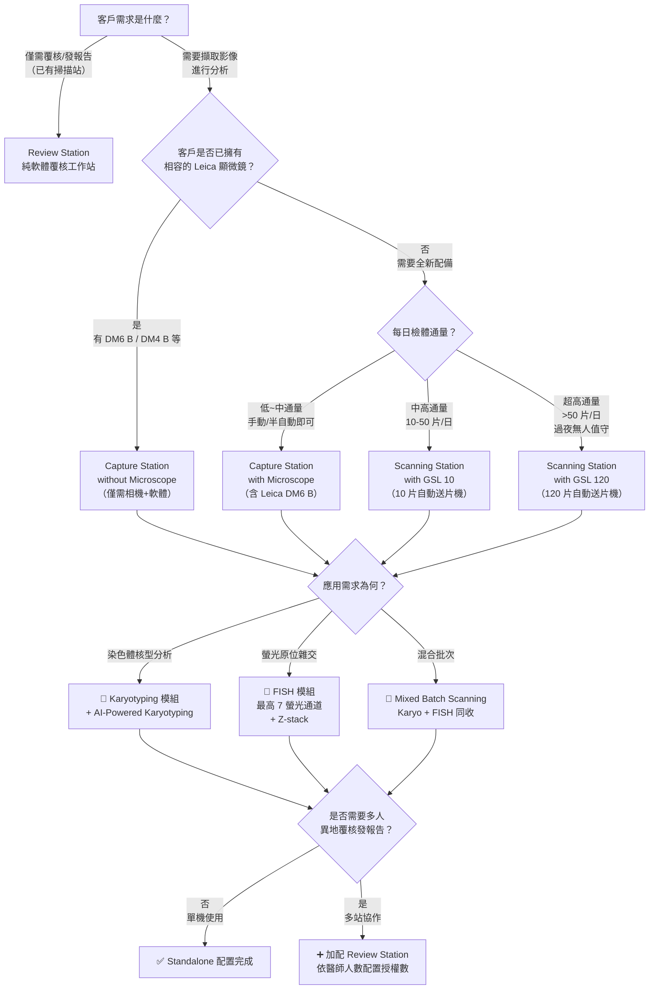

# CytoInsight GSL 系統選型與訂貨指南

> ⚠️ **注意**：CytoInsight GSL 是 CytoVision 的**品牌升級版**（最新世代 8.0），為高度客製化的系統建置，牽涉硬體相容性與 IT 環境設定。本文件提供業務**「選型決策樹」**、**「五種配置層級比較」**與**「AI 功能亮點」**，以幫助您引導客戶選擇正確架構。最終料號請務必以 **Leica Biosystems 官方最新 Pricing Tool** 為準。

---

## 🌳 業務銷售決策樹 (CytoInsight GSL Configuration Decision Tree)

為協助客戶挑選最適合的系統組合，請依循以下決策樹進行探詢：

---

## 📊 CytoInsight GSL 五種配置層級比較

| 配置層級 | 說明 | 適用場景 | 搭配硬體 |
| :--- | :--- | :--- | :--- |
| **Review Station** | 純軟體覆核工作站，遠端連入主系統進行影像分析、排盤與發報告 | 醫師辦公室覆核、多院區遠距協作 | 一般 PC + 網路連線 |
| **Capture Station without Microscope** | 軟體 + 相機模組，客戶沿用現有相容顯微鏡 | 已有 Leica DM6 B / DM4 B 的升級客戶 | 客戶既有顯微鏡 + Leica 12MP CMOS 相機 |
| **Capture Station with Microscope** | 完整工作站：含 Leica DM6 B 全電動顯微鏡 + 相機 + 分析軟體 | 全新建置的中小型實驗室 | Leica DM6 B + 12MP CMOS 相機 |
| **Scanning Station with GSL 10** | 搭配 10 片自動送片機，支援半自動批次掃描 | 中高通量實驗室，每日 10-50 片 | DM6 B + GSL 10 送片機 + 12MP 相機 |
| **Scanning Station with GSL 120** | 搭配 120 片超大容量送片機，自動滴油、條碼辨識，真正 Walk-away | 超高通量代檢中心、國家級實驗室 | DM6 B + GSL 120 送片機 + 12MP 相機 |

> 💡 **GSL 10 與 GSL 120 獨有功能**：支援 **Mixed Batch Scanning（混合批次掃描）**——核型分析、細胞 FISH、組織 FISH 玻片可混合放入同一批次掃描；支援 **Hot Swapping（熱插拔）**——可在掃描進行中暫停、替換載片盤，實現連續不間斷掃描。

---

## 🤖 AI-Powered Karyotyping（AI 智能核型分析）

CytoInsight GSL 最具革命性的升級——內建深度學習 AI 引擎：

| 指標 | 數據 |
| :--- | :--- |
| **手動操作時間減少** | 高達 **93.6%** |
| **染色體分割與定位準確率** | **>99%** |
| **自動流程** | 定位 → 辨識 → 擷取 → 分割 → 配對 → 排列，全程自動 |
| **人機協作設計** | AI 產出初稿，醫檢師僅需審查微調，保留專業判斷 |

> 🎯 **業務話術**：「CytoInsight GSL 的 AI 核型分析引擎可以在數秒內完成過去醫檢師需要 20 分鐘才能做完的染色體排列工作。準確率超過 99%，減少 93.6% 的手動操作時間。這不是取代您的醫檢師——而是把最枯燥重複的工作交給 AI，讓您的專家專注在異常判讀與品質把關。」

---

## 🔬 核心硬體與光學亮點

### Leica DM6 B 全電動研究級顯微鏡
- 超過 **170 年光學研發**傳承，智慧自動化明視野與螢光切換
- 支援 63x / 100x 油鏡自動無人值守擷取

### Leica 12MP CMOS 高感度相機
- 超高解析度、極低雜訊、快速幀率
- 完美呈現染色體條帶 (Banding) 與微細結構細節

### 螢光成像能力
- 單次 assay 最高支援 **7 個螢光通道**
- 自動 Z-Stack 多焦面融合
- 智慧 Assay Builder 定義分類與計數標準

---

## 🧩 軟體分析模組 (Application Modules)

硬體平台選定後，依客戶臨床檢驗項目選購軟體授權：

1. **Karyotyping（染色體核型分析）**
   - G-banding / R-banding 影像擷取、AI 自動分割排盤
   - **含 AI-Powered Karyotyping** (CytoInsight GSL 標配)

2. **FISH（螢光原位雜交分析）**
   - 多色螢光自動合成、Z-Stack 融合、自動斑點計數
   - 支援細胞 FISH 與組織 FISH
   - 智慧 Assay Builder 確保標準化分析

3. **M-FISH（多色螢光核型分析）**
   - 用於複雜染色體重組的多色螢光全染色體分析

4. **Mixed Batch Scanning（混合批次掃描）**
   - GSL 10 / GSL 120 專屬功能
   - Karyotyping、Cell FISH、Tissue FISH 可同批處理

5. **Review Station（覆核工作站）**
   - 遠端明視野與螢光分析
   - 支援 Director Review、多站點協作
   - 依醫師人數配置授權數量

---

## 🔒 安全性與 IT 合規

| 項目 | CytoInsight GSL 8.0 |
| :--- | :--- |
| **作業系統** | **Windows 11** 相容 |
| **資料庫** | Microsoft SQL Server (Client-Server 架構) |
| **使用者管理** | 可配置的角色權限控管、詳細操作日誌 |
| **遠端存取** | 內建整合遠端存取方案 (不另需 VPN 軟體) |
| **網路安全** | 符合現代資安要求，完整稽核軌跡 |

---

## 📅 版本演進對照

| 版本 | 作業系統 | 狀態 | 備註 |
| :--- | :--- | :--- | :--- |
| V 7.2 (Legacy) | Windows 7 | ❌ 停止支援 | 微軟已停止更新，醫院資安不允許連網 |
| V 7.4 / 7.5 | Windows 10 過渡 | ⚠️ 過渡版 | — |
| V 7.7 | Windows 10 / Server 2016/2019 | ✅ 穩定版 | 目前仍在服務的主流版本 |
| **CytoInsight GSL 8.0** | **Windows 11** | 🆕 **最新世代** | 全新品牌、AI 核型分析、12MP 相機、7 通道螢光 |

### 升級與共串規則
1. **Server 版本 ≥ Client 版本**：不可將新版掃描站連上舊版伺服器
2. **強烈建議同版號運行**：確保 SQL 結構一致，避免資料損毀
3. **舊換新 Up-sell 機會**：客戶購買新機台時，若 Server 為 V7.2/7.7，必須併購系統升級包（含 Server + Review Station 升級）

---

## 📝 報價前必問清單 (Pre-Sales Qualification Checklist)

| # | 確認項目 | 影響的配置選擇 |
| :--- | :--- | :--- |
| 1 | 主要應用是什麼？(Karyotyping? FISH? 兩者都要?) | 軟體模組選擇 |
| 2 | 預估每日/每月檢體量？ | Capture / GSL 10 / GSL 120 |
| 3 | 醫院是否已有相容的 Leica 顯微鏡？ | with / without Microscope |
| 4 | 幾位醫師需同時在不同電腦發報告？ | Review Station 授權數 |
| 5 | 是否需要與 LIS 系統介接？ | HL7 模組 / 客製化介接 |
| 6 | IT 能否提供伺服器與儲存空間？ | Server 架構規劃 |
| 7 | 現有 CytoVision 版本為何？(新購 or 升級) | 升級包需求 / 版本相容性 |
| 8 | 是否需要遠端多站點協作？ | 遠端存取方案 |

---

## 📥 相關下載

- [Brochure - CytoInsight GSL (260089 Rev-A)](https://www.leicabiosystems.com/sites/default/files/media_product-download/2026-03/Brochure_-_CytoInsight_GSL-260089_Rev-A.pdf)
- [CytoInsight GSL 8.0 EU RoHS Declaration](https://www.leicabiosystems.com/sites/default/files/media_product-download/2022-09/CytoInsight-GSL-8.0-EU-RoHS-Declaration-June-2022.pdf)
- [Kreatech FISH Probes 產品目錄](https://shop.leicabiosystems.com/zh/ihc-ish/ish-probes-molecular-pathology/)

---

## 🔗 相關產品

- [ThermoBrite 雜交儀](https://www.leicabiosystems.com/zh/ihc-ish/fish-molecular-solutions/thermobrite/)
- [BOND RX 全自動科研級染色機](https://www.leicabiosystems.com/zh/ihc-ish/ihc-ish-instruments/bond-rx/)
