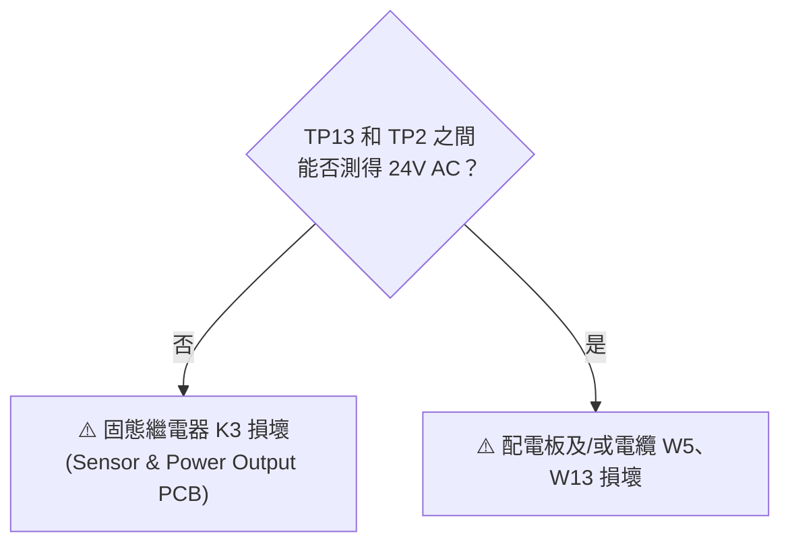
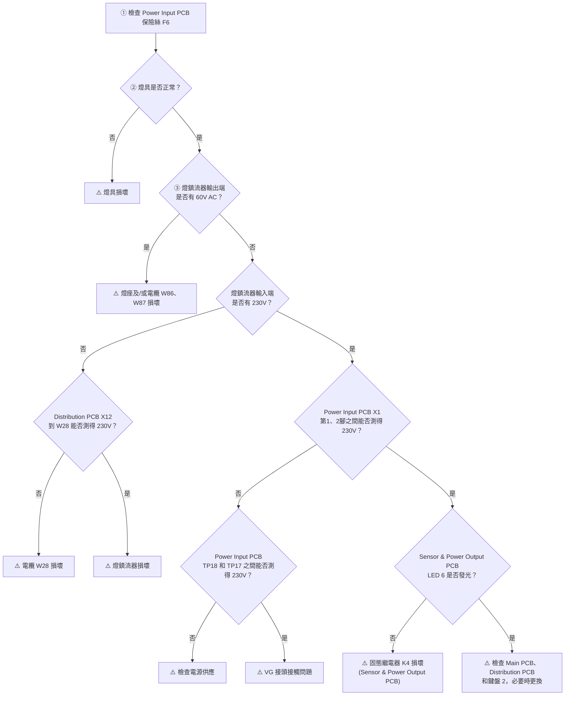
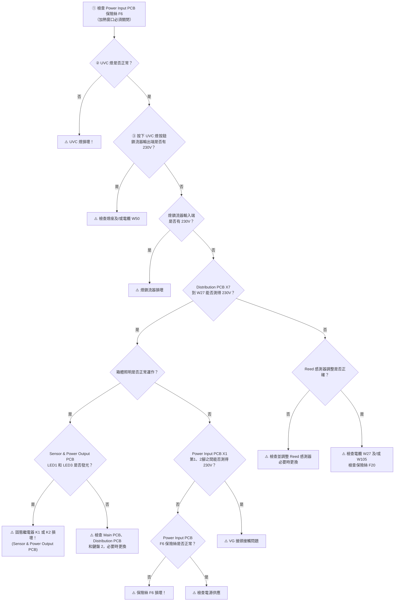
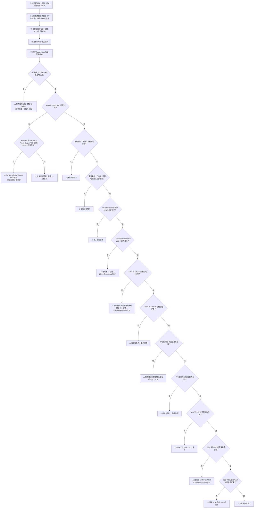
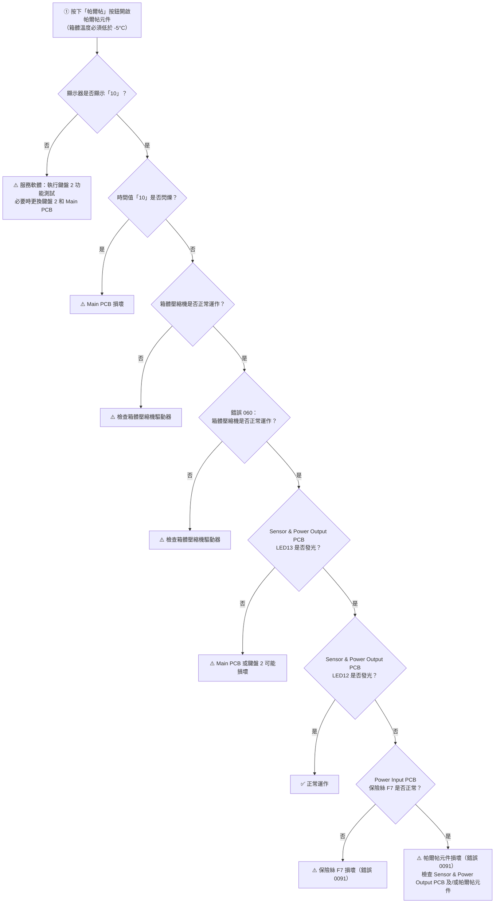
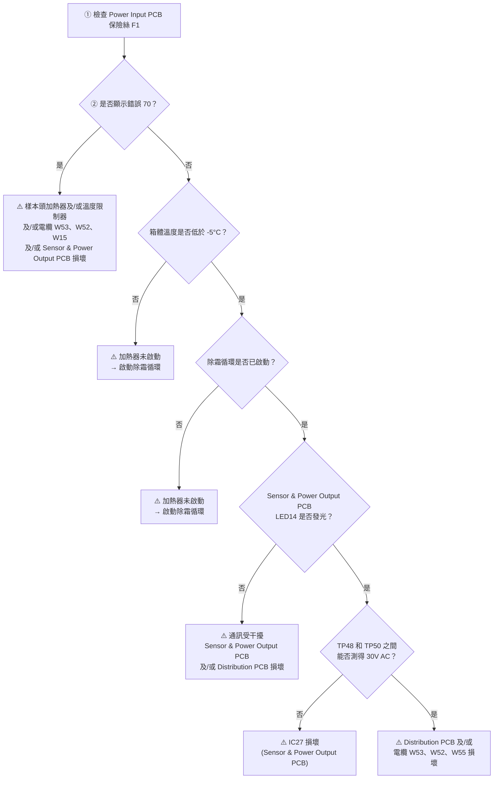
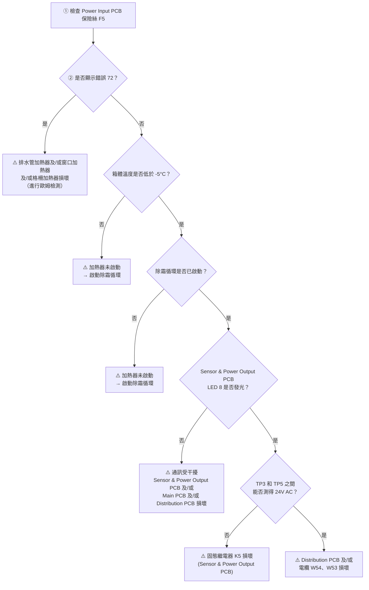
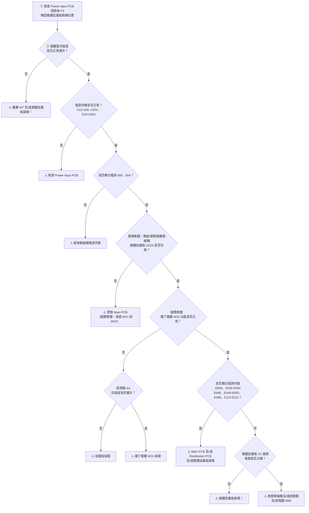
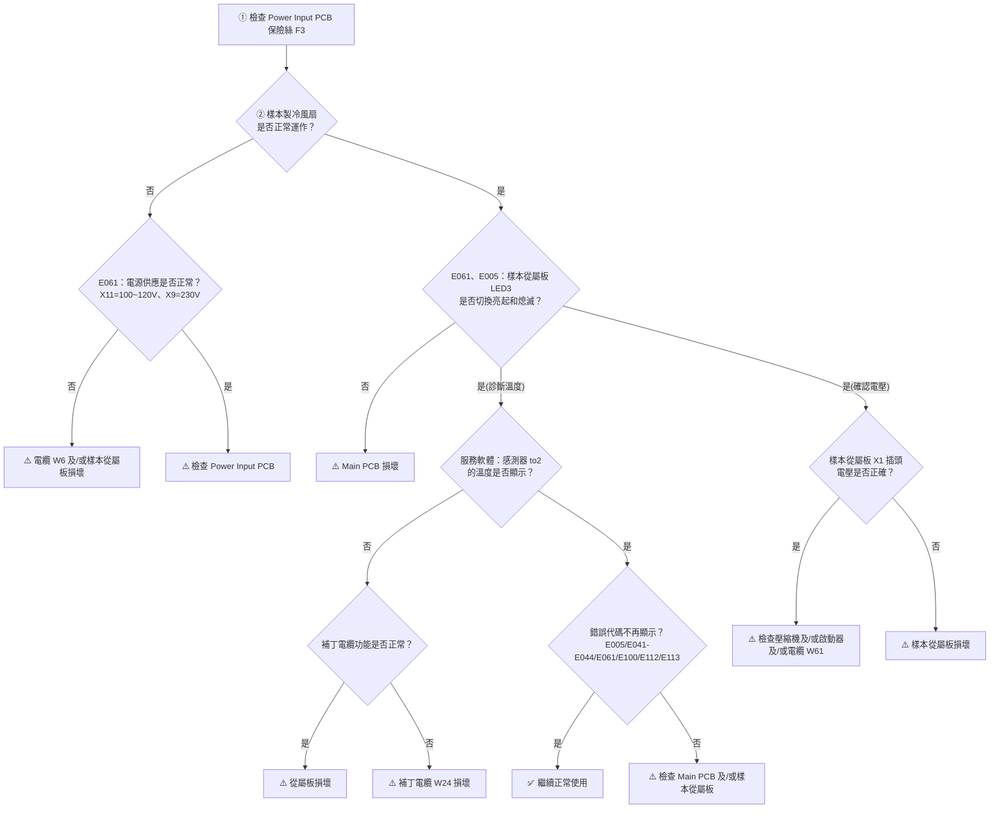

# 服務手冊（公司機密）
## 第 7 章　故障排除
### Leica CM1950 / CM1950S — V1.6
chs.support@leicabiosystems.com

---

## 目錄

- 7.1 錯誤代碼 ............................................................................................................. 5
- 7.2 故障排除 ............................................................................................................. 10
  - 7.2.1 問題：原因與解決方法 .................................................................................. 10
  - 7.2.2 溫度參考表（- °C） ....................................................................................... 12
  - 7.2.3 電子元件 ........................................................................................................ 13
    - 7.2.3.1 滴水盤 ...................................................................................................... 13
    - 7.2.3.2 照明 .......................................................................................................... 15
    - 7.2.3.3 UVC 燈 .................................................................................................... 18
    - 7.2.3.4 切片馬達 .................................................................................................. 21
    - 7.2.3.5 帕爾帖元件 .............................................................................................. 26
    - 7.2.3.6 加熱器—樣本頭 ...................................................................................... 28
    - 7.2.3.7 加熱器—排水管 ...................................................................................... 30
    - 7.2.3.8 壓縮機（箱體） ....................................................................................... 32
    - 7.2.3.9 壓縮機（樣本） ....................................................................................... 35
    - 7.2.3.10 從屬板 .................................................................................................... 38

---

## 7.1 錯誤代碼

錯誤代碼儲存於 CM1950 的內部記憶體中。

錯誤訊息可顯示於時間、除霜時間及錯誤代碼顯示器上。請按下「腔室照明」與「按鍵按鈕」的組合鍵。一旦錯誤已排除，該訊息將不再顯示。

所有錯誤代碼均儲存於 CM1950 的內部記憶體中。當環形記憶體已滿時，儲存新代碼時將覆蓋最舊的代碼。儲存於儀器記憶體中的錯誤代碼可透過服務軟體讀取。

可能對儀器造成損壞的錯誤，將附有紅色服務鑰匙符號。依危險程度，服務鑰匙符號將：
- 定期閃爍（危險等級：警告）
- 持續發出紅光（危險等級：緊急）

| 錯誤代碼 | 說明 |
|----------|------|
| 1 | 無法連接至鍵盤 1 |
| 1 | 從屬鍵盤 2：硬體/軟體版本不支援 |
| 2 | 無法連接至鍵盤 2 |
| 2 | 從屬鍵盤 3：硬體/軟體版本不支援 |
| 3 | 無法連接至鍵盤 3 |
| 3 | 從屬鍵盤 4：硬體/軟體版本不支援 |
| 4 | 無法連接至從屬箱體控制器 |
| 4 | 從屬箱體控制器：硬體/軟體版本不支援 |
| 5 | 無法連接至從屬樣本頭控制器 |
| 5 | 從屬樣本頭控制器：硬體/軟體版本不支援 |
| 6 | PLD 版本不支援 |
| 7 | 警告：即時時鐘—日期無效 |
| 8 | 內部錯誤 |
| 9 | 內部錯誤 |
| 10 | 內部錯誤 |
| 11 | 內部錯誤 |
| 12 | 內部錯誤 |
| 13 | 內部錯誤 |
| 14 | 檔案傳輸失敗 |
| 15 | BIOS 不正確 |
| 20 | A/D 轉換器讀取溫度通道異常 |
| 20 | A/D 轉換器讀取帕爾帖電壓通道異常 |
| 20 | A/D 轉換器讀取步進馬達電流通道異常 |
| 20 | A/D 轉換器讀取樣本頭加熱器電流通道異常 |
| 20 | A/D 轉換器讀取滴水盤加熱器電流通道異常 |
| 20 | A/D 轉換器讀取加熱器電流通道異常 |
| 20 | A/D 轉換器讀取手輪位置通道異常 |
| 20 | A/D 轉換器讀取線路電壓通道異常 |
| 21 | A/D 轉換器讀取驅動板上受控 35V DC 通道異常 |
| 21 | A/D 轉換器讀取驅動板上 51V DC 通道異常 |
| 21 | A/D 轉換器讀取驅動板上 35V DC 通道異常 |
| 21 | A/D 轉換器讀取切片馬達電流通道異常 |
| 22 | 警告：兩個步進馬達限位開關同時啟動 |
| 23 | 步進馬達向前移動，但終止位置限位開關無法啟動（逾時） |
| 24 | 步進馬達向後移動，但原點位置限位開關無法啟動（逾時） |
| 25 | 步進馬達電流無法偵測 |
| 26 | 步進馬達停止電流：數值無效 |
| 27 | 步進馬達運行電流：數值無效 |
| 28 | 步進馬達向前移動，但原點位置限位開關已啟動 |
| 29 | 步進馬達向後移動，但前端位置限位開關已啟動 |
| 30 | 警告：箱體溫度感測器—數值無法偵測 |
| 30 | 警告：箱體溫度感測器—未連接 |
| 30 | 警告：箱體溫度感測器—短路 |
| 30 | 警告：箱體溫度感測器—超過最大限制值 |
| 30 | 警告：箱體溫度感測器—低於最小限制值 |
| 31 | 警告：樣本頭溫度感測器—數值無法偵測 |
| 31 | 警告：樣本頭溫度感測器—未連接 |
| 31 | 樣本頭溫度感測器—短路 |
| 31 | 樣本頭溫度感測器—超過最大限制值 |
| 31 | 樣本頭溫度感測器—低於最小限制值 |
| 32 | 警告：溫度感測器限制器—數值無法偵測 |
| 32 | 警告：溫度感測器限制器—未連接 |
| 32 | 警告：溫度感測器限制器—短路 |
| 32 | 警告：溫度感測器限制器—低於最小限制值 |
| 33 | 警告：溫度感測器限制器—超過最大限制值 |
| 34 | 警告：環境溫度感測器（箱體）—數值無法偵測 |
| 34 | 警告：環境溫度感測器（箱體）—未連接 |
| 34 | 警告：環境溫度感測器（箱體）—短路 |
| 34 | 警告：環境溫度感測器（箱體）—超過最大限制值 |
| 34 | 環境溫度感測器（箱體）—低於最小限制值 |
| 35 | 鰭片式蒸發器入口溫度感測器—數值無法偵測 |
| 35 | 鰭片式蒸發器入口溫度感測器—未連接 |
| 35 | 鰭片式蒸發器入口溫度感測器—短路 |
| 35 | 鰭片式蒸發器入口溫度感測器—超過最大限制值 |
| 35 | 鰭片式蒸發器入口溫度感測器—低於最小限制值 |
| 36 | 鰭片式蒸發器出口溫度感測器—數值無法偵測 |
| 36 | 鰭片式蒸發器出口溫度感測器—未連接 |
| 36 | 鰭片式蒸發器出口溫度感測器—短路 |
| 36 | 鰭片式蒸發器出口溫度感測器—超過最大限制值 |
| 36 | 鰭片式蒸發器出口溫度感測器—低於最小限制值 |
| 37 | 壁式蒸發器入口溫度感測器—數值無法偵測 |
| 37 | 壁式蒸發器入口溫度感測器—未連接 |
| 37 | 壁式蒸發器入口溫度感測器—短路 |
| 37 | 壁式蒸發器入口溫度感測器—超過最大限制值 |
| 37 | 壁式蒸發器入口溫度感測器—低於最小限制值 |
| 38 | 箱體壓縮機入口溫度感測器—數值無法偵測 |
| 38 | 箱體壓縮機入口溫度感測器—未連接 |
| 38 | 箱體壓縮機入口溫度感測器—短路 |
| 38 | 箱體壓縮機入口溫度感測器—超過最大限制值 |
| 38 | 箱體壓縮機入口溫度感測器—低於最小限制值 |
| 39 | 警告：箱體壓縮機出口溫度感測器—數值無法偵測 |
| 39 | 警告：箱體壓縮機出口溫度感測器—未連接 |
| 39 | 警告：箱體壓縮機出口溫度感測器—短路 |
| 39 | 警告：箱體壓縮機出口溫度感測器—超過最大限制值 |
| 39 | 警告：箱體壓縮機出口溫度感測器—低於最小限制值 |
| 40 | 箱體液化器溫度感測器—數值無法偵測 |
| 40 | 箱體液化器溫度感測器—未連接 |
| 40 | 箱體液化器溫度感測器—短路 |
| 40 | 箱體液化器溫度感測器—超過最大限制值 |
| 40 | 箱體液化器冷凝器溫度感測器—低於最小限制值 |
| 41 | 樣本頭壓縮機入口溫度感測器—數值無法偵測 |
| 41 | 樣本頭壓縮機入口溫度感測器—未連接 |
| 41 | 樣本頭壓縮機入口溫度感測器—短路 |
| 41 | 樣本頭壓縮機入口溫度感測器—超過最大限制值 |
| 41 | 樣本頭壓縮機入口溫度感測器—低於最小限制值 |
| 42 | 樣本頭壓縮機出口溫度感測器—數值無法偵測 |
| 42 | 樣本頭壓縮機出口溫度感測器—未連接 |
| 42 | 樣本頭壓縮機出口溫度感測器—短路 |
| 42 | 樣本頭壓縮機出口溫度感測器—超過最大限制值 |
| 42 | 樣本頭壓縮機出口溫度感測器—低於最小限制值 |
| 43 | 樣本頭液化器溫度感測器—數值無法偵測 |
| 43 | 樣本頭液化器溫度感測器—未連接 |
| 43 | 樣本頭液化器溫度感測器—短路 |
| 43 | 樣本頭液化器溫度感測器—超過最大限制值 |
| 43 | 樣本頭液化器溫度感測器—低於最小限制值 |
| 44 | 警告：樣本頭環境溫度感測器—數值無法偵測 |
| 44 | 警告：樣本頭環境溫度感測器—未連接 |
| 44 | 警告：樣本頭環境溫度感測器—短路 |
| 44 | 警告：樣本頭環境溫度感測器—超過最大限制值 |
| 44 | 警告：樣本頭環境溫度感測器—低於最小限制值 |
| 45（緊急） | 溫度感測器板—數值無法偵測 |
| 45（緊急） | 溫度感測器板—未連接 |
| 45（緊急） | 溫度感測器板—短路 |
| 45（緊急） | 溫度感測器板—超過最大限制值 |
| 45（緊急） | 溫度感測器板—低於最小限制值 |
| 46 | 冷凍架溫度感測器—數值無法偵測 |
| 46 | 冷凍架溫度感測器—未連接 |
| 46 | 冷凍架溫度感測器—短路 |
| 46 | 冷凍架溫度感測器—超過最大限制值 |
| 46 | 冷凍架溫度感測器—低於最小限制值 |
| 49 | 冷凍架表面溫度感測器—數值無法偵測 |
| 49 | 冷凍架表面溫度感測器—未連接 |
| 49 | 冷凍架表面溫度感測器—短路 |
| 49 | 冷凍架表面溫度感測器—超過最大限制值 |
| 49 | 冷凍架表面溫度感測器—低於最小限制值 |
| 50 | 帕爾帖架表面溫度感測器—數值無法偵測 |
| 50 | 帕爾帖架表面溫度感測器—未連接 |
| 50 | 帕爾帖架表面溫度感測器—短路 |
| 50 | 帕爾帖架表面溫度感測器—超過最大限制值 |
| 50 | 帕爾帖架表面溫度感測器—低於最小限制值 |
| 60 | 警告：箱體壓縮機—狀況無法偵測 |
| 60 | 警告：箱體壓縮機—開啟時電流值無效 |
| 60 | 警告：箱體壓縮機—關閉時電流值無效 |
| 61 | 警告：樣本頭壓縮機—狀況無法偵測 |
| 61 | 警告：樣本頭壓縮機—開啟時電流值無效 |
| 61 | 警告：樣本頭壓縮機—關閉時電流值無效 |
| 70 | 樣本頭加熱器—狀況無法偵測 |
| 70 | 樣本頭加熱器—開啟時電流值無效 |
| 70 | 樣本頭加熱器—關閉時電流值無效 |
| 71 | 滴水盤加熱器—狀況無法偵測 |
| 71 | 滴水盤加熱器—開啟時電流值無效 |
| 71 | 滴水盤加熱器—關閉時電流值無效 |
| 72 | 排水管加熱器—狀況無法偵測 |
| 72 | 排水管加熱器—開啟時電流值無效 |
| 72 | 排水管加熱器—關閉時電流值無效 |
| 81 | 真空閥（節流）—狀況無法偵測 |
| 81 | 真空閥（節流）—開啟時電壓值無效 |
| 81 | 真空閥（節流）—關閉時電壓值無效 |
| 82 | 真空閥（按鍵）—狀況無法偵測 |
| 82 | 真空閥（按鍵）—開啟時電壓值無效 |
| 82 | 真空閥（按鍵）—關閉時電壓值無效 |
| 90 | 帕爾帖—狀況無法偵測 |
| 91 | 帕爾帖—開啟時電流值無效 |
| 92 | 帕爾帖—關閉時電流值無效 |
| 100（緊急） | 線路輸入電壓—狀況無法偵測 |
| 100（緊急） | 線路輸入電壓—低於最小限制值 |
| 100（緊急） | 線路輸入電壓—超過最大限制值 |
| 101 | 警告：驅動板上 24V DC—狀況無法偵測 |
| 101 | 警告：驅動板上 24V DC—低於最小限制值 |
| 101 | 警告：驅動板上 24V DC—超過最大限制值 |
| 102 | 警告：驅動板上 40V DC—狀況無法偵測 |
| 102 | 警告：驅動板上 40V DC—低於最小限制值 |
| 102 | 警告：驅動板上 40V DC—超過最大限制值 |
| 103 | 警告：箱體壓縮機出口溫度 tv2—低於最小限制值 |
| 105（緊急） | 箱體壓縮機出口溫度 tv2—超過最大限制值 |
| 105 | 警告：樣本頭壓縮機出口溫度 tv2—低於最小限制值 |
| 107（緊急） | 樣本頭壓縮機出口溫度 tv2—超過最大限制值 |
| 110 | 冷凍架閥—狀況無法偵測 |
| 110 | 冷凍架閥—開啟時電流值無效 |
| 110 | 冷凍架閥—關閉時電流值無效 |
| 111 | 鰭片式蒸發器閥—狀況無法偵測 |
| 111 | 鰭片式蒸發器閥—開啟時電流值無效 |
| 111 | 鰭片式蒸發器閥—關閉時電流值無效 |
| 112 | 控制閥—狀況無法偵測 |
| 112 | 控制閥—開啟時電流值無效 |
| 112 | 控制閥—關閉時電流值無效 |
| 113 | 截止閥—狀況無法偵測 |
| 113 | 截止閥—開啟時電流值無效 |
| 113 | 截止閥—關閉時電流值無效 |
| 警告 | 運行小時數—最近一次維修：15,960 小時 |
| 緊急 | 運行小時數—最近一次維修：17,610 小時 |

*表 7-01：錯誤代碼說明*

---

## 7.2 故障排除

### 7.2.1 問題：原因與解決方法

| 問題 | 原因 | 解決方法 |
|------|------|----------|
| 腔室壁結霜 | 冷凍切片機暴露於氣流中（門窗開啟、空調）。 | 更換冷凍切片機的安裝位置。 |
| | 在冷凍腔內呼氣導致結霜堆積。 | 佩戴口罩。 |
| 切片破碎 | 樣本不夠冷。防捲板尚未冷卻，因而使切片升溫。 | 選擇更低的溫度。等待刀片及/或防捲板達到腔室溫度。 |
| 切片碎裂 | 樣本過冷。 | 選擇更高的溫度。 |
| 切片未能正確展平 | 靜電/氣流。樣本不夠冷。 | 排除原因。選擇更低的溫度。 |
| | 大面積樣本。 | 平行修整樣本，增加切片厚度。 |
| | 防捲板位置不正確。 | 重新調整防捲板位置。 |
| | 防捲板與刀緣未對齊。 | 正確對齊。 |
| | 間隙角度不正確。 | 設定正確角度。 |
| | 刀片鈍化。 | 使用刀片的不同部位。 |
| 切片未能正確展平（溫度正確且防捲板對齊情況下） | 刀片及/或防捲板上有污垢。 | 用乾布或刷子清潔。 |
| | 防捲板邊緣損壞。 | 更換防捲板。 |
| | 刀片鈍化。 | 使用刀片的不同部位。 |
| 切片在防捲板上捲曲 | 防捲板超出刀緣的距離不足。 | 正確重新調整。 |
| 切片時及樣本回程時有刮擦聲 | 防捲板超出刀緣過多，正在刮擦樣本。 | 正確重新調整。 |
| 切片有脊狀痕跡 | 刀片損壞。 | 使用刀片的不同部位。 |
| | 防捲板邊緣損壞。 | 更換防捲板。 |
| 切片時出現顫動 | 樣本未充分冷凍固定於樣本盤上。 | 將樣本重新冷凍固定於樣本盤上。 |
| | 樣本盤未夾緊。 | 檢查樣本盤夾緊情況。 |
| | 刀片未夾緊。 | 檢查刀片夾緊情況。 |
| | 樣本切得過厚，已從樣本盤脫落。 | 將樣本重新冷凍固定於樣本盤上。 |
| | 樣本非常堅硬且不均勻。 | 增加切片厚度；如有必要，縮小樣本表面積。 |
| | 刀片鈍化。 | 使用刀片的不同部位。 |
| | 刀型不適合所切樣本。 | 使用不同型號的刀片。 |
| | 間隙角度不正確。 | 設定正確角度。 |
| 清潔時防捲板和刀片出現冷凝水 | 刷子、鑷子及/或布料過熱。 | 將所有工具存放於冷凍腔內的儲物架上。 |
| 調整後防捲板損壞 | 防捲板在刀緣上方過高。調整方向朝向刀片。 | 更換防捲板。下次請更加小心！ |
| 切片厚薄不均 | 組織切割溫度不正確。 | 選擇正確溫度。 |
| | 刀型不適合所切樣本。 | 使用不同型號的刀片（帶狀）。 |
| | 刀背上有冰積聚。 | 去除冰塊。 |
| | 手輪速度不均勻。 | 調整速度。 |
| | 刀片未夾緊。 | 檢查刀片夾緊情況。 |
| | 樣本盤未夾緊。 | 檢查樣本盤夾緊情況。 |
| | 冷凍包埋劑塗抹於冷樣本盤上；冷凍後樣本從樣本盤脫落。 | 將冷凍包埋劑塗抹於溫熱的樣本盤上，安裝樣本後再冷凍。 |
| | 刀片鈍化。 | 使用刀片的不同部位。 |
| | 切片厚度不適當。 | 選擇正確的切片厚度。 |
| | 間隙角度不正確。 | 設定正確角度。 |
| | 顯微切片機未充分乾燥。 | 乾燥顯微切片機。 |
| | 樣本已乾燥。 | 準備新的樣本。 |
| 組織黏附在防捲板上 | 防捲板過熱或位置不正確。 | 冷卻防捲板，或重新正確定位。 |
| | 防捲板的角落或邊緣有油脂。 | 去除防捲板上的油脂。 |
| | 防捲板未正確固定。 | 正確固定。 |
| | 刀片上有鏽跡。 | 去除鏽跡。 |
| 已展平的切片在折起防捲板時捲曲 | 防捲板過熱。 | 冷卻防捲板。 |
| 切片撕裂 | 切割組織的溫度過低。 | 升高溫度並等待。 |
| | 刀片上有鈍化、污垢、灰塵、霜或鏽跡。 | 排除原因。 |
| | 防捲板頂緣損壞。 | 更換防捲板。 |
| | 組織中有硬顆粒。 | — |
| | 刀背上有污垢。 | 清潔。 |
| 冷凍切片機無法運作 | 電源插頭未正確連接。 | 確認是否正確連接。 |
| | 保險絲損壞或斷路器跳脫。 | 更換保險絲，或重新撥回斷路器。若無法解決，請聯絡技術服務。 |
| 樣本盤無法取出 | 底部水分導致樣本凍結於冷凍架或樣本頭上。 | 將高濃度酒精塗抹於接觸點。 |
| 冷凍腔無製冷或製冷不足 | 冷卻系統或電子驅動器故障。 | 聯絡技術服務。 |
| 滑動窗口出現冷凝水 | 空氣濕度和室溫過高。 | 遵守安裝現場的環境要求。 |
| 樣本無製冷或製冷不足 | 冷卻系統或電子驅動器故障。 | 聯絡技術服務。 |
| 燈不工作 | 燈具損壞。 | 檢查燈具，必要時更換。 |
| | 開關損壞。 | 聯絡技術服務。 |
| 兩個消毒 LED 交替閃爍 | UVC 管所提供的 UVC 輻射不足。 | 依照製造商說明更換 UVC 管。 |
| 出現開口扳手圖示表示需要排除故障 | — | 聯絡技術服務並按照指示操作。 |

*表 7-03：問題、原因與解決方法*

---

### 7.2.2 溫度參考表（- °C）

| 組織類型 | 腔室溫度 | 樣本頭溫度 |
|----------|----------|------------|
| 脾臟 | -26°C 至 -30°C | -22°C |
| 肝臟 | -20°C | -30°C |
| | -26°C | 關閉至 -26°C |
| 腸道 | -20°C | -30°C |
| | -26°C | A-：關閉至 -30°C |
| | | E-：-30°C |
| 心臟 | -20°C | A：-30°C |
| | -26°C | E：-30°C 至 -40°C |
| | | 關閉至 -30°C |
| 卵巢 | -20°C | E：-30°C |
| | -26°C | 關閉至 -26°C |
| 輸卵管 | -20°C | E：-30°C |
| | -26°C | 關閉至 -26°C |
| 腎臟 | -20°C | -30°C |
| | -26°C | A：關閉至 -26°C |
| | -30°C | -30°C |
| 肌肉 | -29°C 至 -30°C | -26°C |
| 含脂肪的皮膚 | -29°C | -43°C 至 -50°C |
| 硬脂肪 | -29°C | -32°C 至 -36°C |
| 胃 | -20°C | -30°C |
| | -26°C | 關閉至 -26°C |
| 大腦 | -26°C | -20°C，嵌入式-E |

*表 7-04：溫度參考表（- °C）*

\* A = 堵塞，\* E = 完整

> 上述溫度值基於長期經驗，僅為近似值，因每種組織可能需要特殊調整。

---

## 7.2.3 電子元件

### 7.2.3.1 滴水盤

**滴水盤加熱器無法運作。**

診斷流程：

---

### 7.2.3.2 照明

**照明無法運作。**

診斷流程：

---

### 7.2.3.3 UVC 燈

**UVC 燈無法運作。**（加熱窗口必須關閉。）

診斷流程：

---

### 7.2.3.4 切片馬達

**切片馬達無法運作。**

診斷流程：

---

### 7.2.3.5 帕爾帖元件

**帕爾帖元件無法運作。**（箱體溫度必須低於 -5°C。）

診斷流程：

---

### 7.2.3.6 加熱器—樣本頭

**樣本頭加熱器無法運作。**

診斷流程：

---

### 7.2.3.7 加熱器—排水管

**排水管加熱器無法運作。**

診斷流程：

---

### 7.2.3.8 壓縮機（箱體）

**箱體壓縮機無法運作。**

診斷流程：

---

### 7.2.3.9 壓縮機（樣本）

**樣本壓縮機無法運作。**

診斷流程：

---

### 7.2.3.10 從屬板

**功能說明**

箱體和樣本製冷的從屬板（Slaveboard）相同。為了在匯流排上明確識別兩個從屬板的地址，樣本頭製冷的跳線 JP2 必須設定於 2-3（左側），箱體製冷則設定於 3-4（右側）。

**跳線設定**

若兩個編碼相同的從屬板連接至匯流排，將無法定址，並產生以下錯誤：

| 情況 | 跳線位置 | 錯誤代碼 | 箱體 LED 狀態 | 樣本 LED 狀態 |
|------|----------|----------|--------------|--------------|
| 箱體從屬板：跳線位置 3-4；樣本從屬板：跳線位置 3-4 | 相同 | E004、E005、E112、E113、E061 | LED1=亮、LED2=亮、LED3=亮 | LED1=亮、LED2=亮、LED3=亮 |
| 箱體從屬板：跳線未連接；樣本從屬板：跳線未連接 | 相同 | E004、E005、E110、E112、E113、E061 | LED1=滅、LED2=滅、LED3=亮 | LED1=滅、LED2=亮、LED3=亮 |
| 箱體從屬板：跳線位置 2-3；樣本從屬板：跳線位置 2-3 | 相同 | E004、E005、E110、E111、E060、E061 | LED1=亮、LED2=亮、LED3=滅 | LED1=亮、LED2=亮、LED3=滅 |
| 箱體從屬板：跳線位置 3-4；樣本從屬板：跳線未連接 | 不同 | E004、E005、E110、E111、E112、E113、E060 | LED1=滅、LED2=滅、LED3=亮 | LED1=脈動、LED2=亮、LED3=亮 |
| 箱體從屬板：跳線未連接；樣本從屬板：跳線位置 3-4 | 不同 | E004、E005、E112、E113、E060、E061 | LED1=亮、LED2=亮、LED3=滅 | LED1=亮、LED2=亮、LED3=滅 |
| 箱體從屬板：跳線未連接；樣本從屬板：跳線位置 2-3 | 不同 | E004、E005、E110、E111、E060 | LED1=滅、LED2=滅、LED3=滅 | LED1=滅、LED2=亮、LED3=亮 |

*表 7-05：跳線位置 JP2*

---

## 版本修訂歷史

| 版本 | 發布日期 | 修訂內容 |
|------|----------|----------|
| 1.0 | 2008 年 5 月 | 新文件 |
| 1.10 | 2021 年 10 月 | 完整文件更新：頁首頁尾修正、細菌過濾器替換為 HEPA 過濾器、第 00 章（第 3 頁）移除郵箱和訂單號、輸入發布日期 |
| 1.50 | 2022 年 11 月 | 切換至新範本；修正所有章節連結；雙語版面改為單語版面；引入免責聲明；第 1 章信號詞更新；第 2 章圖面修正；第 5 章擴充可訂購工具；第 7 章移至第 6 章並移除過時內容；第 6 章和第 9 章合併為第 7 章；移除空白章節 |
| 1.51 | 2024 年 3 月 | 服務手冊更新至 CM1950 & CM1950S；第 5 章新增 CM1950S 中文前面板 |
| 1.6 | — | 所有章節更新 TSB 內容；零件章節更新中國本地化零件 |

---

*Leica CM1950/CM1950S – V1.6*
*Leica Biosystems Nussloch GmbH，海德堡大街 17-19，D-69226 Nussloch*
